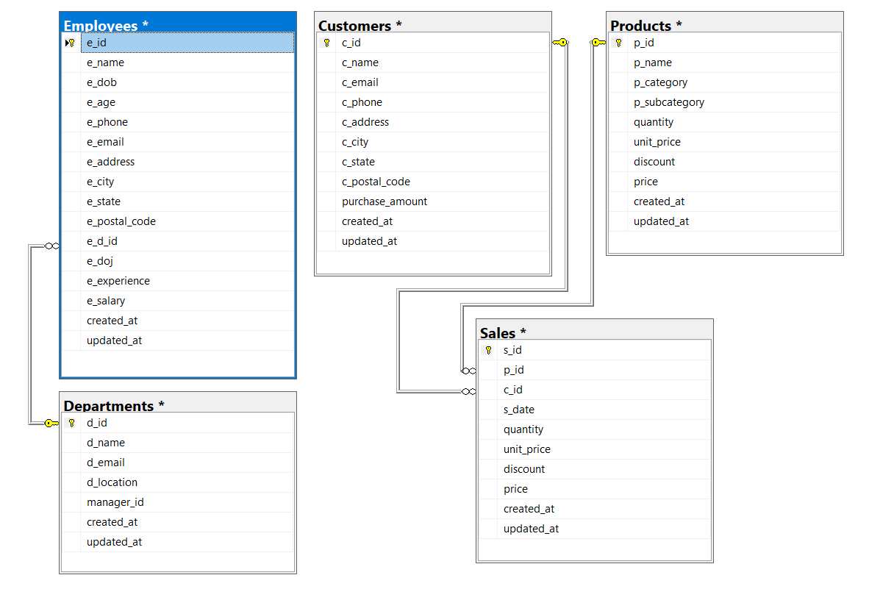
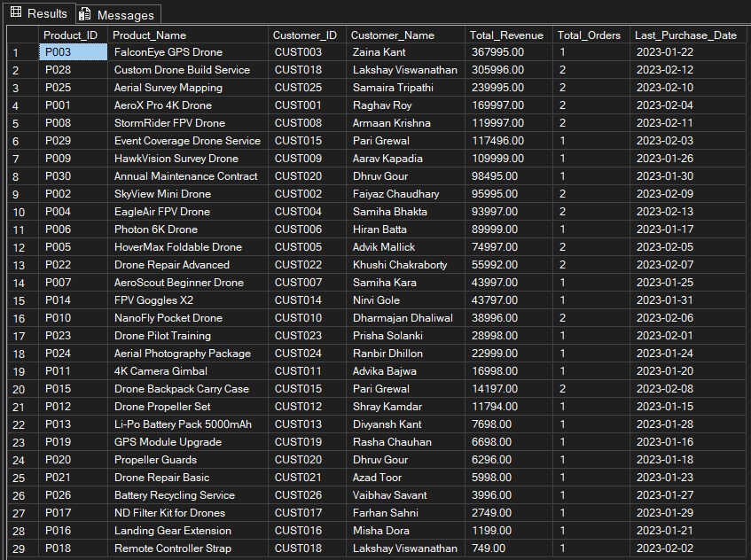
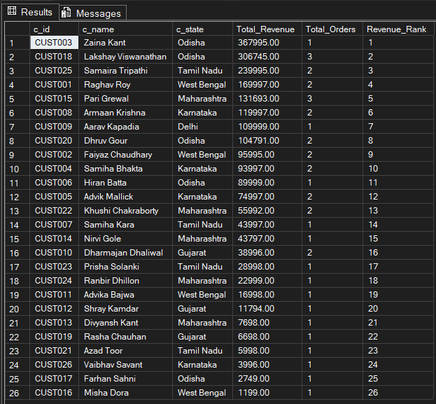

<!DOCTYPE html>

<h2>🎯 Project Objective</h2>
<par>
The objective of this project is to analyze the sales performance of Xeta Squad Ltd, a drone manufacturing and service company, using SQL Server. The project focuses on transforming raw transactional data into meaningful business insights by generating key reports such as Revenue Analysis, Top Customer Analysis, and Sales Performance Reports.
</par>
<h4>Through this analysis, the goal is to:</h4>
<ul>
  <li>Identify top-performing products, customers, and regions</li>
  <li>Evaluate overall revenue trends and growth patterns</li>
  <li>Support strategic decision-making for sales optimization and business expansion</li>
</ul>

<h2>🗄 Database Design</h2>
<ul>
<li>Five core tables: <code>Employees</code>, <code>Departments</code>, <code>Products</code>, <code>Customers</code>, <code>Sales</code>.</li>
<li>Primary and foreign keys ensure referential integrity.</li>
</ul>
<h3><i><b>ER Diagram</b></i></h3>

<h2>📊 Features</h2>
<ul>
<li>Realistic sample data for employees, customers, products, and sales.</li>
<li>Analytics for finding revenue insigts. </li>
<li>Analytical queries: aggregations, joins, subqueries.</li>
</ul>

<h2>📈 Insights & Reports</h2>
<ul>
<li>Top revenue-generating products.</li>
<li>Repeat customer analysis by state.</li>
<li>Highest-paid employees and department comparisons.</li>
<li>Monthly revenue trends for decision support.</li>
</ul>
<h3><i><b>Revenue Reports</b></i></h3>

<h3><i><b>Top Customers Sales Analysis</b></i></h3>

<h2>📂 Folder Structure</h2>
<pre>
SQL-Based Business Insights for Drone Sales and Services/
├─ README.html
├─ Database/
│ ├─ create_database.sql
│ ├─ insert_data.sql
│ ├─ analysis_queries.sql
│ └─ views_triggers.sql
├─ Reports/
│ ├─ revenue_report.png
│ └─ top_customers.png
├─ Documentation/
│ ├─ ER_Diagram.png
│ └─ Project_Report.pdf
└─ LICENSE
</pre>

<h2>🚀 Getting Started</h2>
<ol>
<li>Clone this repository.</li>
<li>Open Microsoft SQL Server Management Studio (SSMS).</li>
<li>Run <code>create_database.sql</code> to create tables and relationships.</li>
<li>Execute <code>insert_data.sql</code> to populate sample data.</li>
<li>Run <code>analysis_queries.sql</code> for analytics and reporting queries.</li>
</ol>

</body>

</html>

